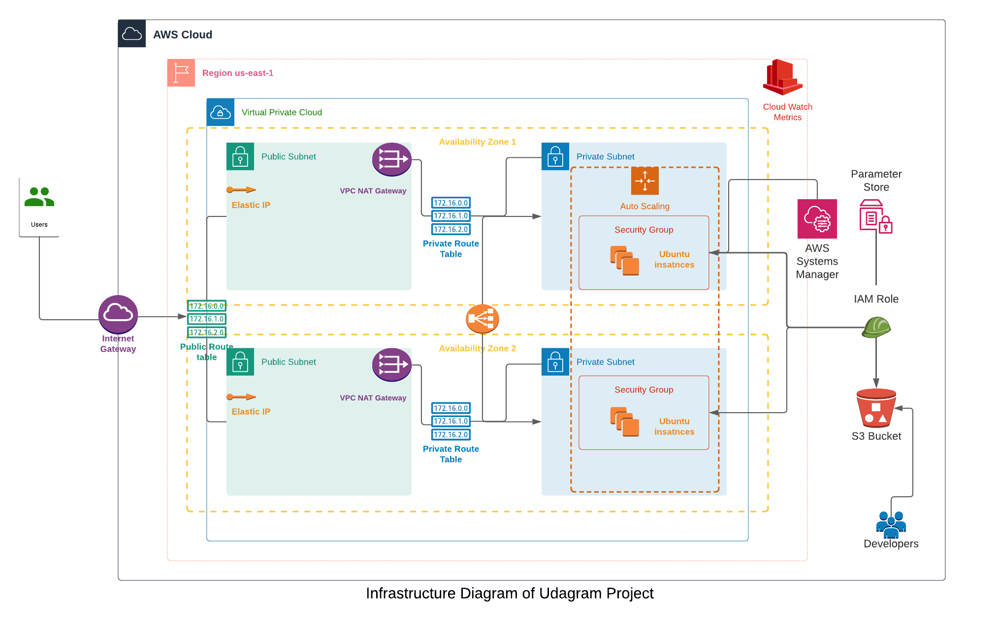

# Project 2 - Deploy a High-availability Web App using CloudFormation

Deploy a high-availability web app to a secure network with automated monitoring of CPU and Memory with CloudWatch.

## Architecture Diagram

## Create Stack
Make sure app.zip exists in an S3 bucket and name passed in parameter. 
Sample source file in src folder

>./create.sh {Stack Name} CloudFormationTemplate/deploy.yml CloudFormationTemplate/parameters.json

## Update stack with update command.

>./update.sh {Stack Name} CloudFormationTemplate/deploy.yml CloudFormationTemplate/parameters.json

## Delete stack with 
> delete.sh {stack-name}
 
 
Connect to your private instance with [AWS Session manager](https://docs.aws.amazon.com/systems-manager/latest/userguide/session-manager-getting-started.html). Update launch config for custom scripts.

### Basics

- [x] Neccessary Parameters
- [x] Resource creation such as Load balancer, Launch Configuration, AutoScaling Group, Health Checks, Security Group, Listener and Traget Groups
- [x] Outputs with Load balancer DNS name and http in front of it
- [x] Working URL

### Load balancer

- [x] Autoscaling group with a target group and a listener rule associated with same target group
- [x] Health Check and Listener

### Auto-scaling

- [x] Private subnet for autoscaling instances
- [x] No keyname property in launch configuration

### Optional 

- [x] AWS Parameter store usage for accesing credentials
- [x] CloudWatch Alarms and Cloudwatch metrics
- [x] Using Conditionals instance allocation based on environment

Please refer to the [URL link](http://udagr-webse-1rcs699tia6z6-104911570.us-east-1.elb.amazonaws.com/)