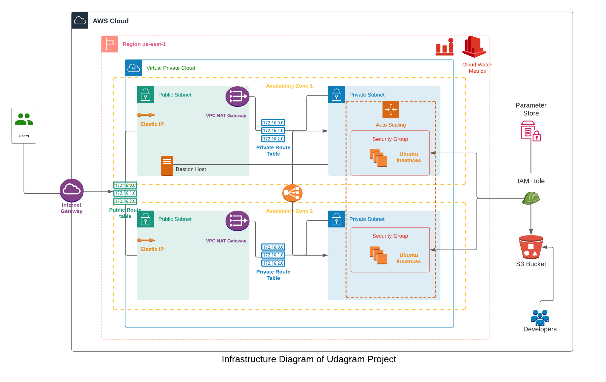

# Project 2 - Deploy a High-availability Web App using CloudFormation

Deploy a high-availability web app to a secure network with automated monitoring of CPU and Memory with CloudWatch.

## Architecture

## Create IAM with 

>./create.sh {IAM stack name} IAM/setup-iam.yml IAM/setup-iam.json

## Create S3 and upload project zip folder

>./create.sh {S3 stack name} IAM/bucket.yml IAM/bucket.json

## Create Network 

>./create.sh {Network stack name} Network/network.yml Network/network.json

## Create Servers with launch configuration for app deployment

>./create.sh {Server stack name} Server/sever.yml Server/server.json

Update stacks using update.sh for required stack. 
Delete stack with 
> delete.sh {stack-name}
 

Connect to your private instance with [AWS Session manager](https://docs.aws.amazon.com/systems-manager/latest/userguide/session-manager-getting-started.html). Update launch config for custom scripts.