## Scenario
Your company is creating an Instagram clone called Udagram. Developers pushed the latest version of their code in a zip file located in a public S3 Bucket.
You have been tasked with deploying the application, along with the necessary supporting software into its matching infrastructure.
This needs to be done in an automated fashion so that the infrastructure can be discarded as soon as the testing team finishes their tests and gathers their results.

# Network Stack

## 1. Setup VPC, Internet Gateway and Gateway Attachment 

### Architecure Diagram

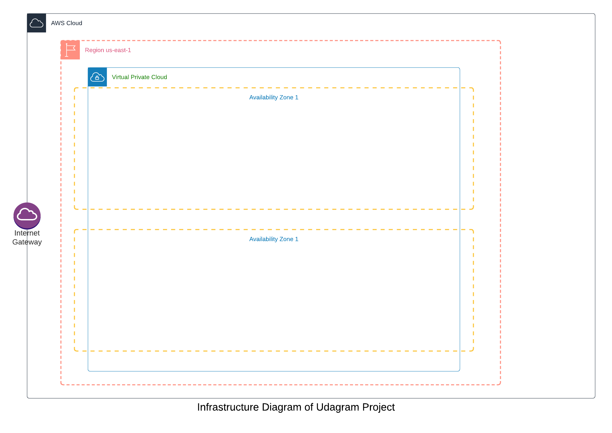

### Resources and Outputs

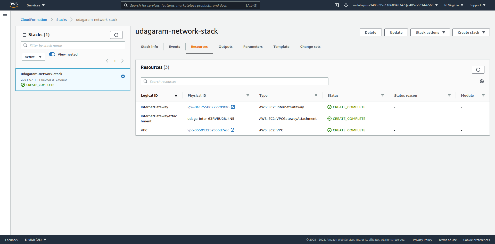
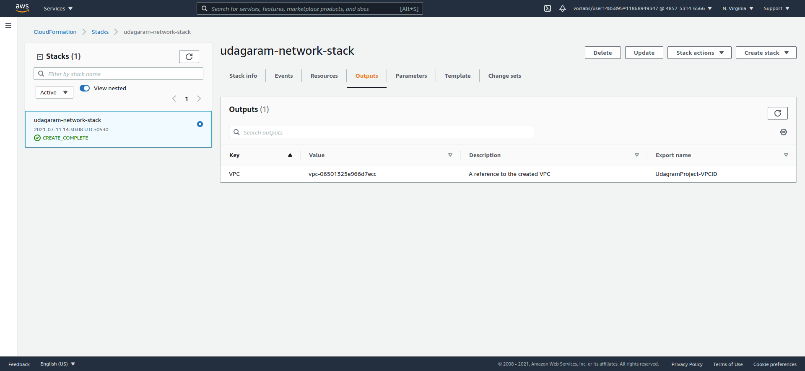

## 2. Setup Public and Private subnets inside VPC and interconnect with NAT Gateway and its  Route table association

### Architecture Diagram

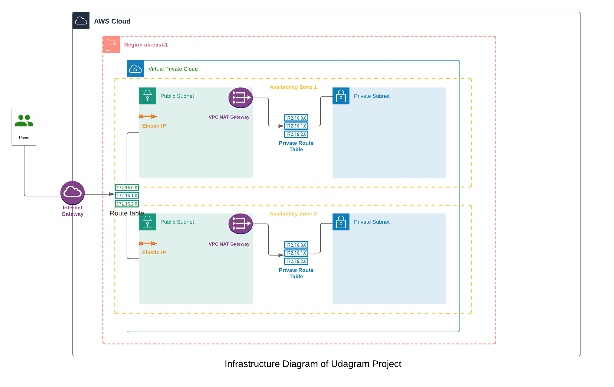

### All Resources needed for network stack

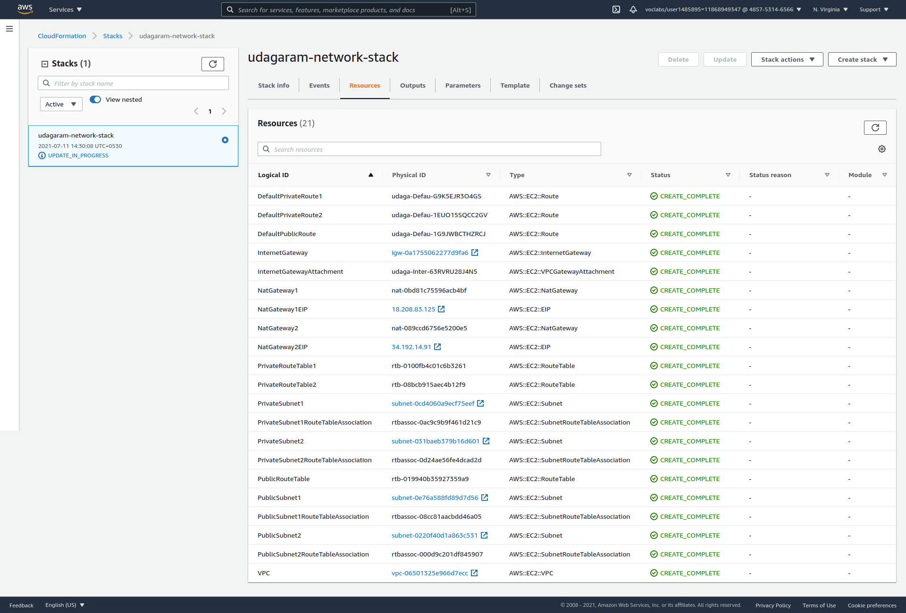

### Final Outputs of network stack

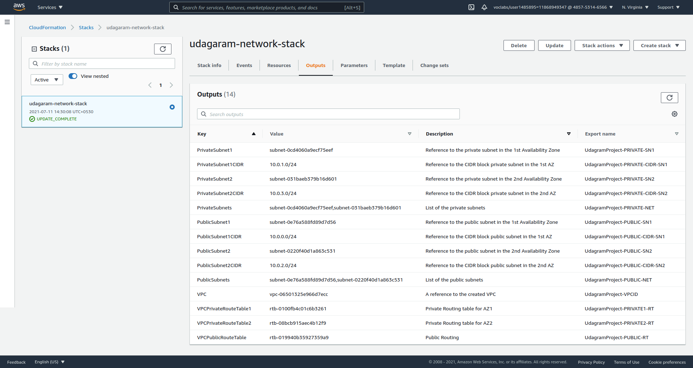

# S3 and IAM
### 3. Upload a web app zip to an S3 bucket

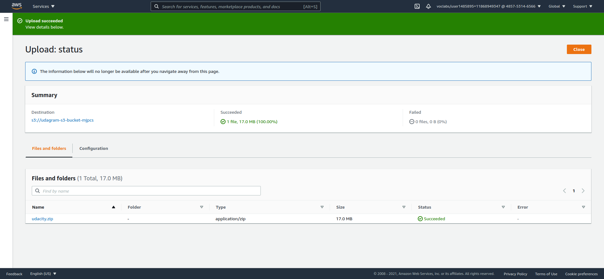

## 3. Create an Instance Profile for IAM

### IAM resources with relevant policies to access the S3 bucket

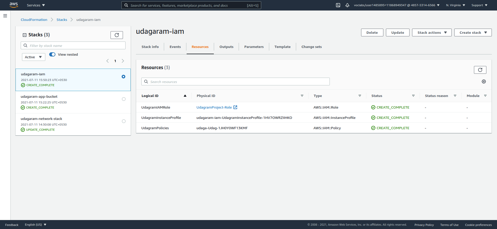

### IAM outputs

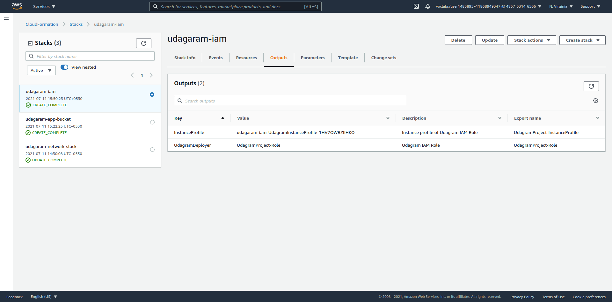

# Server Stack

## 5. Setup Autoscaling Security groups, Load balancer with Launch Configurations and target groups and test deployment

- Deploy the static site created in [previous project](https://github.com/pravinmj-cs/aws-static-site) with Load balancer, listener and target groups with health check. An optional conditional was added to choose instance types for different environments using Conditions and !If function. We use t2.micro if its of development environment type and t3.small if it is of production environment
- Deploy with KeyName property in Public Cloud initially for debugging and to check if the IAM role can **get** values from **SSM parameter store**. Deployment and getting parameter was successful.
- Then the Keyname property was removed and deployed into Private subnet

### Architecture Diagram Update
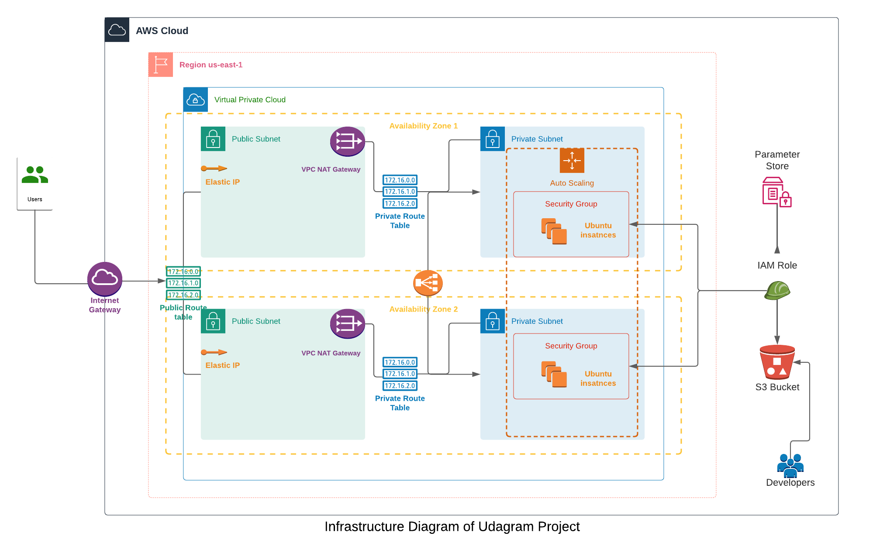

### Load Balancer, Health check and target group

#### Tested with Public network with development environment

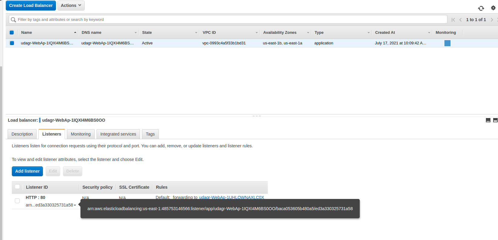
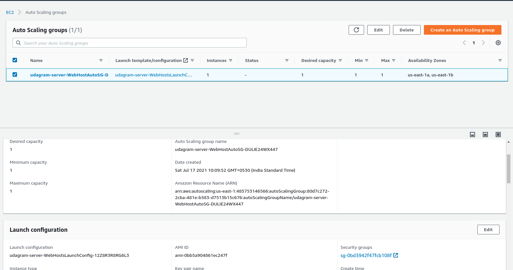

#### Moved to private network, updated EnvironmentType to production environment and update autoscaling policy

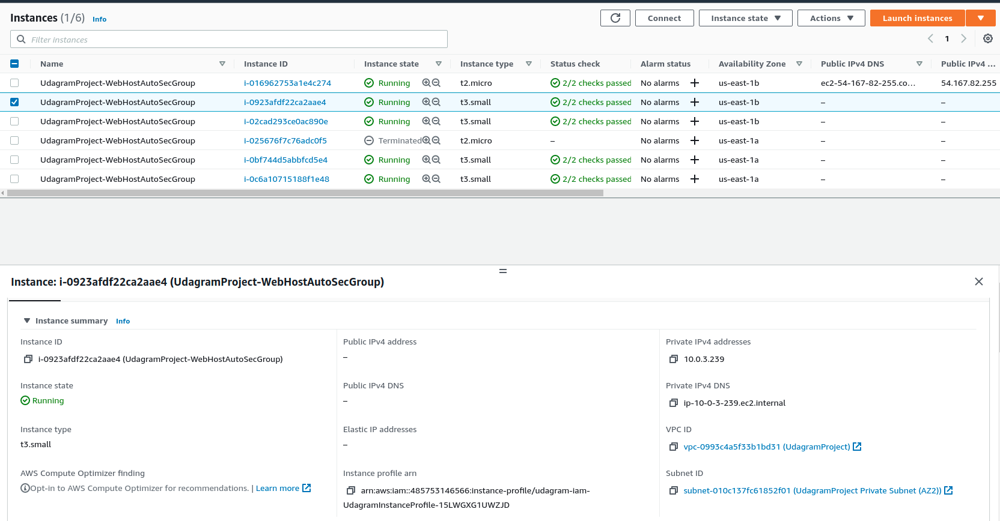
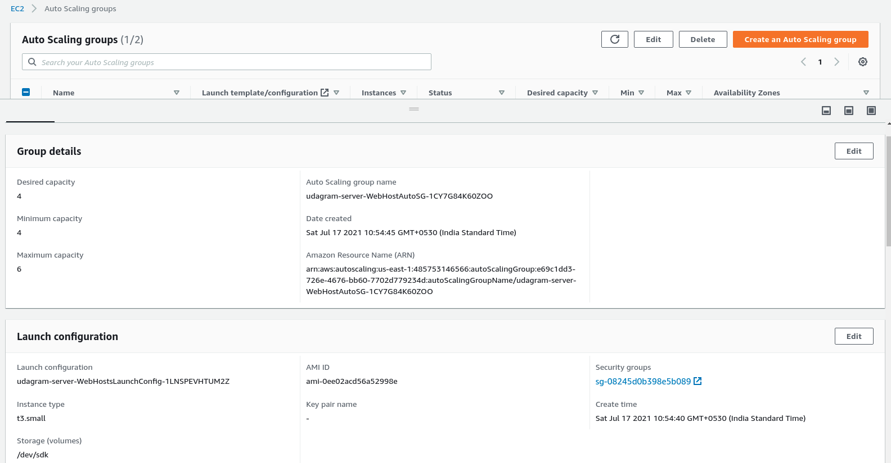

#### Update stack to include Cloud watch metrics to monitor CPU and Memory

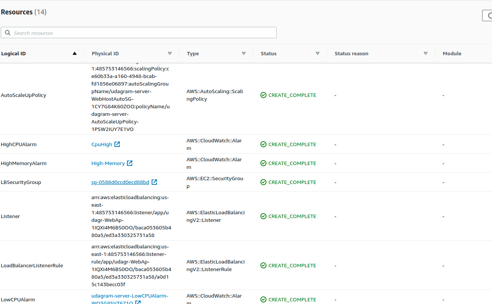
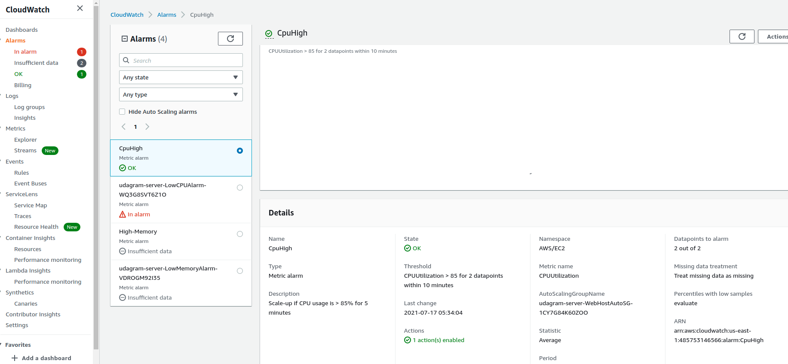

#### Load Balance Output HTTP URL
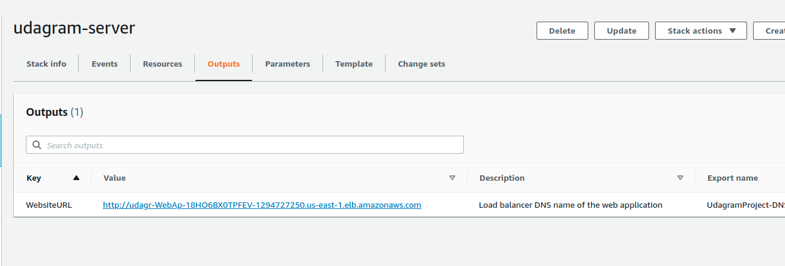

#### Tried to connect with Session Manager after updating stack to install ssm agent and updating instance profile policy
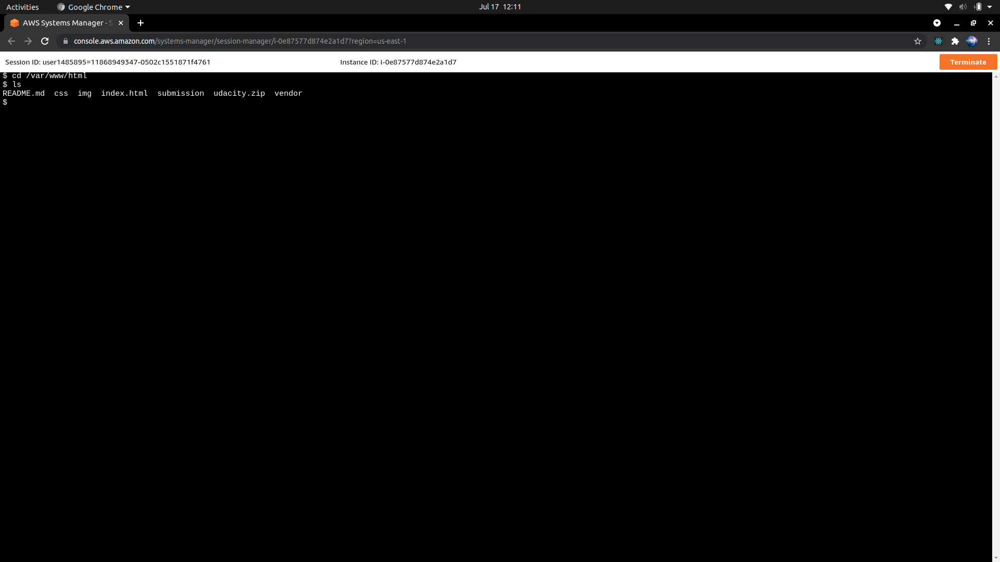

#### Hosted Site
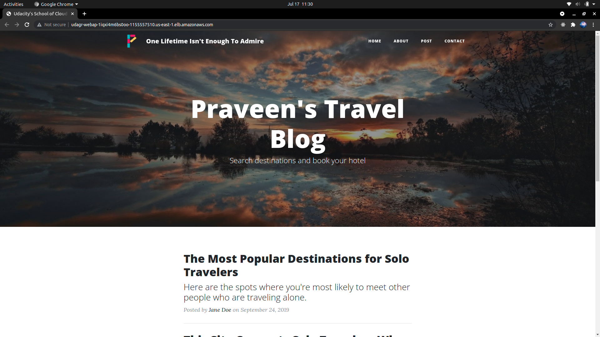

Scaled down instances and update environment type to run as development to avoid charges. 

Arrange namespaces and template formats, Removed Stack and tested one full recreation
Please refer to the hosted [link](http://udagr-webap-y6f31c66k93r-1021377290.us-east-1.elb.amazonaws.com/)

## Requirements Achieved

### Basics

- [x] Neccessary Parameters
- [x] Resource creation such as Load balancer, Launch Configuration, AutoScaling Group, Health Checks, Security Group, Listener and Traget Groups
- [x] Outputs with Load balancer DNS name and http in front of it
- [x] Working URL

### Load balancer

- [x] Autoscaling group with a target group and a listener rule associated with same target group
- [x] Health Check and Listener

### Auto-scaling

- [x] Private subnet for autoscaling instances
- [x] No keyname property in launch configuration

### Optional Requirements

- [x] Stacks are created individually so outputs can be used efficiently
- [ ] Setup a Bastion host for connecting the private servers(Partially). Failed to authenticate pass phrase error. Raised request for mentor help. But connected to private instance by updating template and setting up Session manager.
- [x] AWS Parameter store usage for accesing credentials
- [x] CloudWatch Alarms and Cloudwatch metrics
- [x] Using Conditionals and Different types for input property like CommaDemilitedList